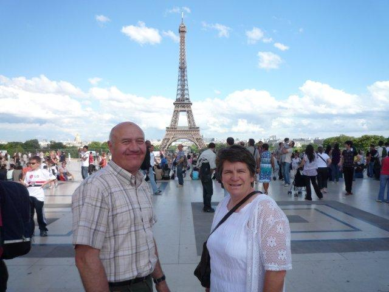

[La Maison De Mes Parents - Mi - Ours](http://www.jiwa.fr/track/Ours-297/Mi-7997/La-Maison-De-Mes-Parents-10570.html)

Pour la première fois en 7 ans, mes parents sont venus il y a 15 jours (soit le we, long, très long we du 14/07). Y'aura pas grand chose à raconter, à part que ma mère a été épatée par les espaces verts que l'on pouvait avoir à Paris. Ben ouai, j'ai feinté, ils ont eu la visite du Muséum d'Histoire Naturelle (ne pas confondre avec le musée de l'émission de TV du même nom) et du Champ de Mars.

Je ne me serai jamais autant promené dans ma ville depuis ma toute première arrivée ici (si vous suivez bien ça fait 7 ans), à part avec un vague Philippe (nom commun donné par [Mme Troll](http://nanctroll.canalblog.com/) à mes mecs)

Ah si, une phrase culte de ma mère en arrivant "Je pourrais jamais habiter ici"

Forcement, quand tu habites en Haute Marne dans [un village de 80 habitants](http://fr.wikipedia.org/wiki/Ninville), que tu es habituée à la verdure, aux grandes maisons et aux jardins (fourni toujours de base avec la maison), ben 33m² à Boulogne, ça perturbe un peu...

Nous n'avons pas pu faire tout ce que j'avais prévu, Papa avait gravement mal au genou (qu'il essaye de guérir avec un psychopathe rebouteux)

M'ont dit qu'ils reviendraient. Why not?

L'anecdote drôle:  quand mes parents sont arrivés, je venais juste de mettre dehors mon Philippe du mois. Croyant les voir arriver tard le soir, nous avions tranquillement flâné et vaguement digressé. Remercions donc tous ensemble ma sœur qui m'a prévenu à temps pour éviter à mes parents de me trouver avec Philippe, à moitié nu, dans des draps un peu salaces... Autant les "Tétu" aux chiottes, ça, je m'en fiche, mais ça ça aurait été un peu violent pour eux. Sœur d'Amour, je te vénère pendant un mois, c'est décidé!
