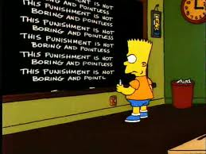

A l'instant, en raccrochant mon téléphone, je viens de me rappeler cette vilaine punition que nous infligeait notre prof d'anglais au collège...

Quand tu bavassais trop avec les keupines, tu gagnais un an de bon d'achat à la foire-fouille 50 fois à copier 'I mustn't be a chatterbox'. Je pense qu'en fait, à l'époque, nous étions des petits joueurs.

Récemment, quelqu'un m'a dit (que tu m'aimais encore... non, c'est pas ça) 'Pffft qu'est-ce que tu es bavard!'. Pipi de chat - encore -  puisque je viens de trouver le [MASTER](http://www.youtube.com/watch?v=D88HMQF8W_4&feature=related) des pipelettes. Et c'est mon filleul !

30 minutes d'appel ce soir pendant qu'il est en vacances chez sa grand-mère, 20 minutes de monologue du filleul.

 

Qui dit mieux ?
