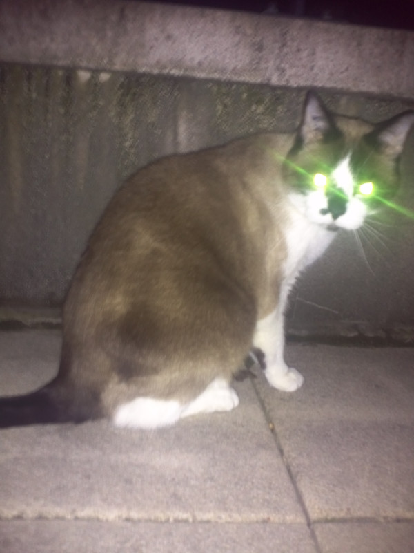

 En ce moment, le chat des voisins aime me faire quelques visites en début de soirée via mon balcon.

C'est en le prenant en photos que j'ai découvert l'effroyable vérité.

Ce chat si mignon et si affectueux (il ronronne quand je lui fais des caresses et me répond quand je l'appelle, so cute) est en fait un redoutable extraterrestre venu nous envahir et nous hypnotiser grâce à son ronron démoniaque!

 

La preuve en image pour ceux qui en douteraient...
