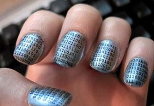
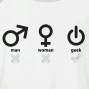
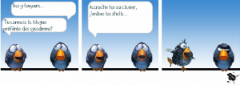
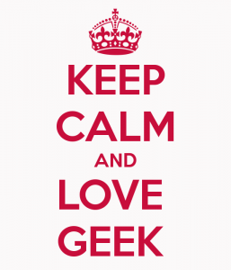

_Le voici, le voilà, l’inédit pour nous. Le projet [Ginette/Gillette](http://gingil.blogspot.fr/)._ _L’idée est simple : comme nous sommes une bande de potes qui aimons se retrouver, nous nous sommes dis que s’incruster sur les blogs des autres serait une idée marrante._ _Pour ma part, c’est chez [Planète Coquette](http://www.planetecoquette.fr/) que ça se passe._ _Chez moi, c’est [La Poudre Aux Yeux](http://lapoudreauxyeux.wordpress.com/) qui s’y colle._ _L’exercice étant d’autant plus difficile qu’il faut rester dans la ligne éditoriale du blog hôte._ _Je laisse place à mon invitée et la remercie d’avoir joué le jeu._

\==========================================================

 

Du plus loin que je me souvienne, j’ai toujours eu un profil, un raisonnement « littéraires ». Mais que je n’ai jamais trop développés car le pan de ma personnalité écrasant tous les autres c’est la feignasserie.

Un profil littéraire pour un geek, en gros c’est un profil bordélique, j’ai erré toute ma jeunesse à me demander « qui suis-je, que fais-je, pourquoi la vie, la mort, le soleil ? Argh. »

Mais je me suis soignée, j’ai un vrai travail maintenant, que j’adore, et 2 ou 3 passions qui m’animent. Ceux qui me connaissent de près ou de loin savent que mes questionnements sont plutôt « quel est le meilleur fond de teint ? Qui a inventé l’estompage ? Pourquoi les poils, les cagoles, le crayon à lèvres plus foncé que le rouge à lèvres ??? Oh mais pourquoiiiiii ??? »

Et comme la vie c’est toujours l’aventure, voilà que je me retrouve à bosser pour une entreprise de l’internet. Au départ je faisais surtout du mail, je répondais aux clients et de fil en aiguille, de câbles wireless en bugs, je me suis retrouvée il y a 3 ou 4 ans à prendre possession d’un bureau dans une DSI.

Kesako ? Direction des Systèmes d’Information = endroit de l’entreprise à la plus forte densité de geeks. C’est comme le Sephora des makeupgeeks, tu trouves de tout là-bas : des gens qui analysent des bases de données, ceux qui font de la business intelligence (ils tordent des données pour filer des stats aux marketteux), des architectes (oui oui pour que tout ça s’articule il faut des architectes, c’est comme un immeuble virtuel), chez nous il y a aussi l’équipe des super-héros qui ne travaillent pas sur un sujet particuliers mais qui viennent au secours des développeurs à bout de nerfs et de Red bull. Quand ils déboulent à ta table c’est que ça pue les emmerdes.

D’ailleurs j’ai trouvé une définition hyper sympa rien que pour vous ! Développeur (nom masc.. singulier) : Organisme vivant servant à convertir la caféine en code.

 

Ça c’est pour l’humour mais dans la vraie vie… c’est à peu près ça.

 

Le développeur ça n’aime pas du tout quand tu dis que c’est un geek mais moi je m’en fous, je suis une [noob](http://fr.wikipedia.org/wiki/Newbie), et je le resterai vu que je ne mets pas les mains dans le cambouis.

C’est quoi mon boulot alors ? Je suis celle qui murmure à l’oreille des geeks.

Sauf que pour faire ça faut apprendre à communiquer avec eux et mon immersion totale m’a laissé des séquelles.

 

Maintenant quand j’entends :

« Ta mè​re elle est tellement grosse que pour la dé​placer faut la compresser dans un ZIP! » => ça me fait marrer.

« Les trois plus grandes catastrophes mondiales :Hiroshima '​45, Chernobyl '​86, Windows '​95 » => je fais pipi dans ma culotte.

Quand il y en a un qui dit « Faut que tu blindes ton string » ben je sais que ça cause pas petites culotte mais chaîne de caractères. Et parfois, moi aussi je fais des blagues de geek. Si si.

Je sus devenue une sorte d’hybride un peu schizo, un Google translate Human => Geek.

Quand j’écris des mails à mes collègues, je ne fais plus des paragraphes pleins de mots. Nan.

Maintenant je suis :

\- Organisée - Synthétique - Et je mets des tirets

- Sur plusieurs niveaux
    - Mon cerveau est une arborescence.
    - Je me sens comme une poupée russe.
- Dans tous mes mails.

\- STRUC-TU-REE !!!

 

Mais toujours un peu tarée, expansive, tonitruante, quand je gueule pas, je suis morte de rire, je les titille mes geeks, je les soule, je les secoue, je leur pose des questions à la con. Et ils me le rendent bien, je crois même qu’ils m’aiment bien. Mais pas autant que moi je les aime <3

 

)34|\\||)3 |)3 |\*37!75 ©0(\_,)|\_|!|\\|0|\_|5 !

 

