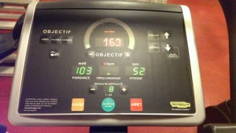

http://www.musiqueapproximative.net/tracks/Mickey%20Lesbordes-Les%20Marchands%20de%20la%20sant.mp3

_Mickey Lesbordes - Les marchands de la santé_

Voyant mon poids augmenter comme la nuit, j'ai du me résoudre à m’inscrire à une salle de sport. Bon, ce n'est pas venu de mon propre chef mais d'un concours de circonstances.

Je me lève un matin (et je me bouscule, je ne me réveille pas...), passe sur la balance, constate avec horreur que j'approche du quintal. Je me dis qu'il va falloir y remédier un jour et que pourquoi pas demain (ou après demain ou un autre jour). Arrivé au bureau, une toute nouvelle fille super gentille qui me rappelle SatanaS avec un accent du sud nous dit qu'elle a un super prix pour la salle de sport qui est à cinq minutes à pieds du bureau. Salle où il y a des machines de torture fitness et des cours pour transformer ton corps en Gym Queen.

Il ne faut pas grand chose pour que j'y voies un signe du destin: pas cher, pas loin (je rappelle que je bosse à dix minutes à pieds de chez moi), je suis vieux et je dois faire attention à mon pauvre petit corps. Je me dis que je vais m'inscrire et SatanaS du sud me fait visiter la salle. C'était il y a un mois.

Oui, il me faut au moins un mois pour tout mettre en place après. Parce que je suis lent par nature et de surcroit pas pressé pour un sou.

Premier échec: une fermeture surprise du médecin qui fera que je n'ai pas eu mon certificat médical dès la première semaine (elle a une vie et a bien raison). Pas grave, j'y suis retourné quelques jours plus tard et je repars avec mon certificat après des tests prouvant que mon corps peut souffrir sans exploser.

Deuxième semaine: je suis allé acheter mes chaussures (en plus de mes nouvelles chaussures couleur 1ères règles du matin - AOC de notre future collaboration avec SatanaS).

Troisième semaine: j'ai shoppé chez Go Sport (Decathlon n'existe pas dans mon centre commercial de bourges) mon haut et mon short de sport.

Un mois plus tard, j'ai fait mon chèque et j'ai le précieux sésame mais je suis éreinté par tant d’épreuves alors je rentre fissa chez moi. Non, en fait, ma timidité mal placée m'a fait abdiquer parce que j'avais un peu les chocottes de parler aux gens pour leur demander comment ça marche.

Une semaine plus tard: Jeannie Longo ! Ce soir, avec SudanaS, nous sommes allés au sport. Au SPORT ! Il m'a fallu cinq minutes pour comprendre le fonctionnement des vestiaires, cinq autres pour enfiler ma tenue de lumière et zou ! Le petit prof gentil m'a brieffé vite fait et j'ai fait mes quarante premières minutes de Vélib' à côté de ma collègue qui gesticulait dans tous les sens sur une machine chelou.

C'était bien sympathique et je dois y retourner jeudi soir parce que le prof sera libre pour me faire un cours de 'quelle machine utiliser si je veux faire travailler mon triceps droit ?'. Ma machine à laver tourne, mes fringues seront prêtes pour jeudi ... Un geek musicien qui fait du sport, totalement woh ménopause quoi...
