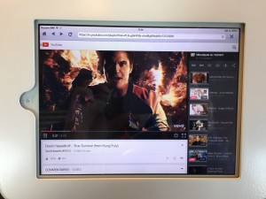
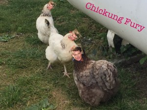

Nous sommes partis avec ma couille, la somptueuse [Diana Cagothe](http://blog.plumpytrash.com/) pour un road trip initiatique en direction de la maison familiale en Ariège. Bon, c'était surtout pour descendre Nadine, sa merveilleuse R5 pour qu'elle y prenne sa retraite mais l'occasion était trop bonne pour la louper... Comme je ne sais pas du tout si j'aurais beaucoup de réseau et/ou la possibilité de poster régulièrement, ben je vais commencer un billet que j'agrémenterai au fil du temps si j'en ai l'envie et la 3G.

**\-- #RoadTrip:**

RDV à midi chez moi, nous mangerons puis nous partirons parce que quand même c'est mieux de faire le trajet le ventre bien plein. Je passerai sur la shame du japonais (et des resto en général à Diana).

Nous avons commencé à dérouler du kilomètre vers 14h30 direction Orléans, parce qu'avec une R5, c'est toujours mieux de prévoir des petites étapes.

Nous y arrivons tranquillou pépère vers 17h et nous décidâmes de nous poser le temps de manger une glace dans un McDuck. Et nous y découvrons un tout autre monde: des tablettes en libre service, des super caisses high tech avec un super écran qui te dit en temps réel ce que tu es en train de commander et des terminaux CB NFC.

 Ce moment était trop magique pour continuer: Nadine n'a plus voulu repartir. Rien, pas l'envie, plus de motivation, rébellion contre son starter, elle nous a fait le coup pendant une petite dizaine de minutes et on a sacrément eu les chocottes que nos vacances se finissent dans un HLM de Boulogne... Ce n'est qu'en lui faisant peur en lui disant que M. Troll viendrait nous rechercher et qu'on la laisserait comme une pauvresse sur le parking qu'elle a bien voulu repartir.

La route, la route, de la superbe musique grâce à la magie des smartphone, de la musique dans le cloud et des enceintes bluetooth (Nadine est radio-less à ce moment là de l'histoire) et quelques questions existentielles du genre "tu crois que Diam's écoute Michel Sardou chanter Musulmanes", débat commencé et terminé par moi-même avec un "il a quand même une belle voix". Nous avons trouvé un champs un peu caché où faire du camping sauvage parce qu'on est des fous et qu'on a pas encore trop d’arthrose.

Debout avec le chant des putains d'oiseaux, je m'extasie sur le fait qu'on a dormi à côté d'[orchidées](https://fr.wikipedia.org/wiki/Orchis_m%C3%A2le), extase rapidement éteinte par la déconcertante non-facilité à replier ma tente Quechua XL Air DeLuxe et à la notice trop complexe pour une quiche de la tente. Diana sangle la tente et la jette comme une merde dans son coffre me promettant qu'on aura le fin mot de cette histoire dans notre villégiature.

Le repas du midi fut encore un échec assez cuisant. Nous nous sommes assis dans une pizzeria. La serveuse nous a demandé ce que nous voulions manger 'des travers de porc, une cuisse de pintade ou un croque monsieur'. Pas de carte, pas de pizza... Les seules pâtes que nous avons mangées étaient celles qui accompagnaient nos plats. Comme nous avons l'habitude, nous avons filé jusqu'à la maison en luttant contre l'envie de siester jusqu'à la mort.

**\-- [Ouvrons les fenêtres](http://www.dailymotion.com/video/xhwx0g_les-volets-clos_music):**

 Oh ! La voisin a des poules, c'est chouette !

Clic-clac, nous ouvrons la maison et ses volets pour faire entrer un peu de chaleur puis nous nous sommes posés quelques heures pour pouvoir médire tranquillement sur à peu près le monde entier. Ben oui, on est à la campagne, normalement, c'est là qu'on médit non ?

\-- Je profite d'une sieste de Diana C
