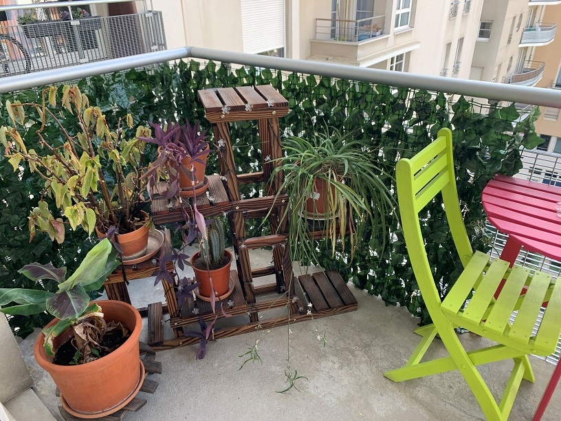

Pour faire vite et bien, et pour ceux qui ne le sauraient pas encore, j'ai très bien vécu mon confinement. Évidemment, je suis privilégié parce que j'ai un appartement de 2 pièces et plus ma cage à poules et un balcon; ce n'est pas une maison à la campagne avec un jardin, mais pas non plus mon ancien appart' de 25m² d'une pièce où j'aurai du vaquer à mes occupations entre mon lit en mezzanine et le dessous de celui-ci.

Cette 'expérience' m'a permis, déjà, de répondre à la grande question que je m'étais lancée à la fin de la coloc' en 2009: "Puis-je vivre seul?". La réponse est "oui, mais avec la fibre et une chambre séparée du salon".

Mais pourquoi il se termine seulement maintenant alors que j'ai repris le taf depuis le premier jour du déconfinement en mai. Et bé, peuchère, parce que j'avais mis en branle (mwarf) plusieurs activités que je n'avais pu terminer. J'ai trouvé de quoi m'occuper pendant ce confinement, à titre personnel parce que dans mon taf, nous n'étions pas super prêt pour le télétravail et quand on y était à peu près, on avait plus assez de matos...

Alors, je me suis initié à la MAO (musique assistée par ordinateur) et mine de rien, savoir que si on échoue, on peut recommencer le lendemain, ça aide beaucoup à ne pas avoir l'impression de perdre son temps. Et la MAO c'est un vaste monde: entre les logiciels selon son système d'exploitation, les instruments, les histoires de latence,... ça peut vite devenir tordu.

J'en ai aussi profité pour peaufiner un module de formation que j'avais créé en compilant plusieurs autres. Ça avait une tête de la créature de Frankenstein mais ça tenait la route. Maintenant, ça tient la route mais c'est joli comme tout: des logo en HD, une vraie pagination et mise en page. J'y ai passé plusieurs jours parce que modifier un PDF n'est pas chose aisée, et toi-même tu sais, jeune lecture avide d'aventures.

Enfin, histoire de m'occuper aussi de ma maison, j'avais entamé le lessivage de mes murs et autre nettoyage approfondi. Alors, ça, je l'avais gardé pour le plus tard possible parce que c'est chiant. Sauf qu'avant la fin, j'ai dû retourner au turbin et mettre tout ça en pause.

```
¸¸♬·¯·♩¸¸♪·¯·♫¸¸Puis le temps passât et la vie reprit sa route tel un papillon se libérant du filet d'un collectionneur un peu trop zél鸸♬·¯·♩¸¸♪·¯·♫¸¸
```

Treize jours ago, un collègue a été testé positif au COVID-19 donc, en tant que cas contact, je me suis retrouvé en quatorzaine. Bien sûr, le mien s'est avéré négatif (comme mes résultats de concours d'ailleurs... un espèce de constante karmique).

Et bien, zim bam boum, j'ai fini les grands travaux: j'ai retourné mon salon pour me faire un joli endroit 'bureau avec vue sur le dehors' pour le télétravail si un jour j'y ai le droit.

J'ai aussi acheté un lustre et fait l'électricien pour le monter après une dizaine seulement de tutos youtube et je viens de recevoir mes canisses en pétrole fausses feuilles en plastoc' à poser sur mon balcon pour protéger, non pas ma vie des voisins parce que ça je m'en tamponne le coquillard - ils n'ont qu'à pas regarder - mais mes petites fleurs qui sont exposées plein soleil toute la journée et que j'oublie fréquemment d'arroser.




Ah, oui, je suis aussi en train d'apprendre 'Qui a la droit' de Patrick Bruel au piano parce que c'est notre chanson du moment au bureau.

J'ai donc, officiellement, terminé mes travaux commencés lors du confinement. Ce qui me permet de titrer ce billet et d'aller m'ouvrir une bière pour me féliciter du travail accompli.
