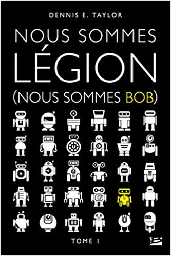

 {: .img-left}

Bob (Johansson) vient de vendre sa start-up à prix d'or. A lui la belle vie! Pour commencer, tant qu'à avoir de la maille, il signe un contrat pour se faire cryogéniser le cerveau à sa mort et ainsi pouvoir ressusciter s'il meurt, quand la science aura suffisamment avancé pour pouvoir le faire.

En sortant du bar où il fête sa vente avec ses associés, il se fait écraser en traversant la rue. Lorsqu’il revient à lui, un siècle plus tard, c'est pour découvrir qu'il appartient désormais au gouvernement. Le pouvoir politique a changé du tout au tout et son contrat a été purement annulé. Il se retrouve téléchargé dans un ordinateur et est en lice pour devenir une IA. Son instructeur lui explique qu'il devra prendre la commande d'une sonde intersidérale pour explorer l'univers à la recherche d'une planète habitable. La Terre est dans un état lamentable et l'humanité commence à suffoquer. Le deal est simple: accepter ou se faire débrancher.

Mais c'était sans compter sur les autres superpuissances qui, elles aussi, souhaitent avoir leur propre IA dans l'espace et ainsi être les 1er dans cette course technologique. Pour Bob, l'endroit le plus sûr, c'est dans l'espace, le plus loin possible de la Terre mais rien ne se passera comme prévu.

* * *

Cette série de 3 tomes se lit bien à l'aise calé dans le tramway. Bon, ce n'est pas le roman le plus complexe du monde mais une petite histoire d'IA dans l'espace ne fait jamais de mal. C'est léger et divertissant d'autant que j'ai eu beaucoup d'empathie pour le personnage principal: geek, un peu asocial mais volontaire pour aider les autres, je me serais vraiment vu dans sa peau. Là où l'histoire devient intéressante c'est quand on apprend que la sonde contenant Bob peut se faire répliquer grâce à des imprimantes 3D, nous nous retrouvons donc avec des dizaines de Bob tous avec un caractère différent mais une base commune.

Au gré des tomes, Bob - désormais immortel - et ses autres comparses découvriront un univers riche en vie mais aussi en ennemis potentiels tout en essayant tant bien que mal de sauver l'humanité d'elle-même.

Un détail qui m'a plu: cette série a une vraie fin. Je ne compte plus les fins bâclées à l'arrache qui m'ont gâché le plaisir du voyage dans les pages. Mon seul bémol: ne pas avoir plus de profondeur au niveau des personnages tiers, ni des civilisations. Tout passe toujours par le point de vue de Bob et c'est un peu dommage. C'est sûrement un parti-pris pour montrer la fugacité des autres face à un être sur lequel le temps n'a plus prise mais j'aurai aimé quelques pages supplémentaires sur d'autres protagonistes.

Un bon bouquin de mon été que je recommande sans problème, disponible en poche ou livre électronique.
